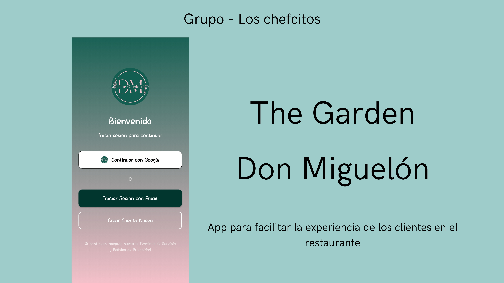
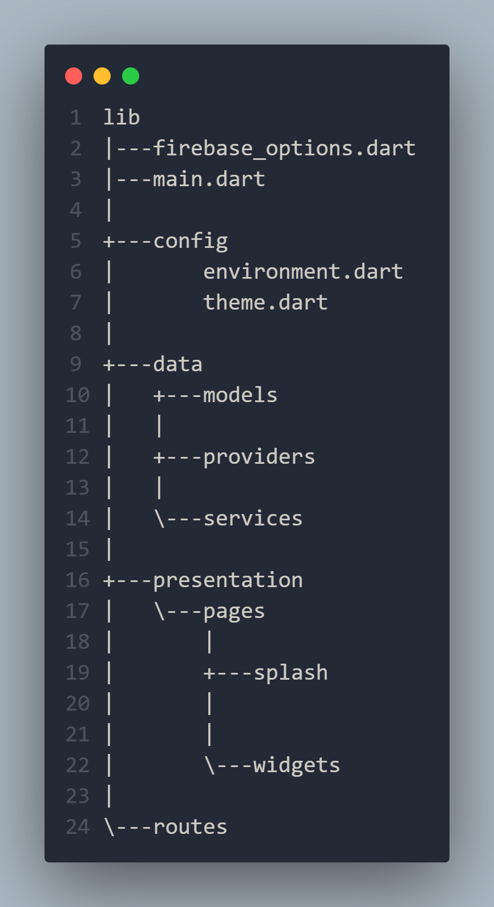

# Aplicación móvil para el cliente del restaurante The Garden Don Miguelón

Aplicación móvil desarrollada en Flutter para los clientes del restaurante The Garden, permitiendo:

- Visualizar el menú y sus categorías
- Realizar pedidos desde la app
- Reservar mesas
- Gestionar información de su perfil

La app consume APIs del backend para garantizar seguridad y sincronización con la base de datos.
Incluye autenticación con Google mediante Firebase, y todo el contenido (menú, reservas, usuarios, pedidos, etc.) es administrado desde un panel web de administración.

## Instalacion

#### Clonamos el proyecto

```bash
git clone https://github.com/JHuancaDev/flutter_restaurante.git
```

#### Instalamos las dependencias

```bash
flutter pub get
```


## Requerimientos para correrlo
- Flutter 3.32.3
- Dart 3.8.1
- Android Studio - Emulador movil

## Estructura del proyecto




